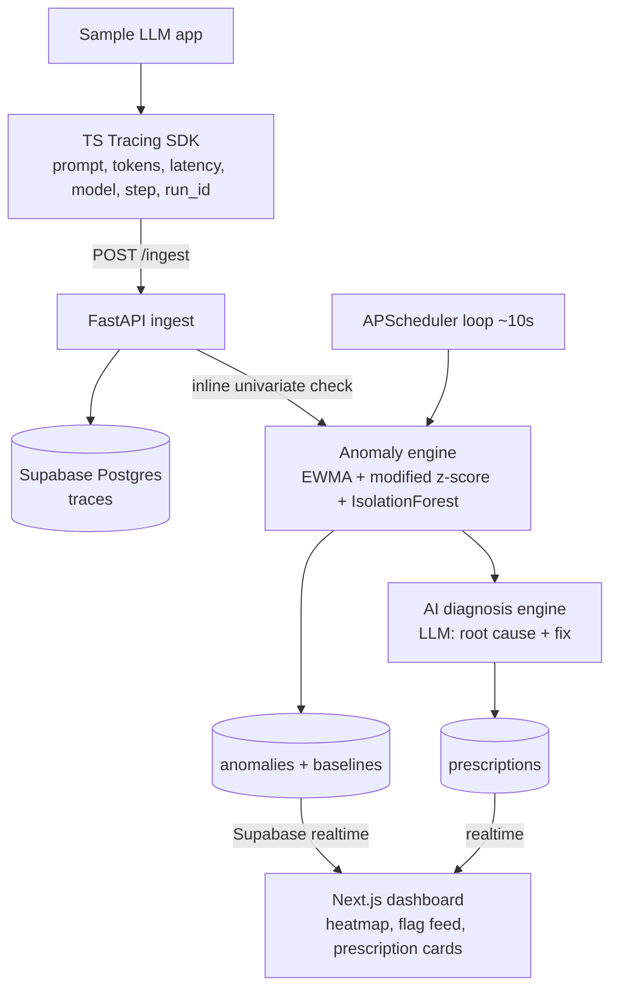

# Anomaly Copilot — 24h Hackathon

> **"Datadog tells you what broke after it broke. We tell you what's about to break — and why."**

An ambient-intelligence anomaly engine for LLM workflows. A TypeScript tracing SDK feeds traces into a FastAPI + Supabase backend; a statistical + ML anomaly engine flags token / latency / cost / context anomalies in real time; and an AI diagnosis engine turns each anomaly into a root-cause + prescribed fix on a live Next.js dashboard.

## Positioning

We hone in on the **passive anomaly layer**: an always-on engine that watches LLM traces and flags token-burn spikes, latency spikes, cost anomalies, and context-overflow risk *before* they bite — then prescribes a fix.

The shared **AI diagnosis engine** is the heart. Everything (heatmap, flags, tips) is a view over its output. We defer the active copilot features (test-gen, prompt-diff, bottleneck-sim) to keep 24h focused.

## Ownership

- **ML / data** — anomaly engine + diagnosis engine (the differentiator).
- **Backend eng** — SDK + ingest API + Supabase wiring.
- **Frontend eng** — the dashboard.

## Architecture

## Detection design (the core)

Per-call feature vector: `input_tokens, output_tokens, reasoning_tokens, total_tokens, latency_ms, cost_usd, context_utilization (= total/context_limit), error`.

- **Univariate, real-time (on ingest):** per `(step_name, model, metric)` keep an incremental robust baseline. Flag with modified z-score `z = 0.6745 * (x - median) / MAD`, threshold `|z| > 3.5`. EWMA (`alpha ~0.3`) tracks streaming mean/var so it adapts. O(1) per trace.
- **Context-overflow warning:** `context_utilization > 0.8` warn, `> 0.95` critical — the "about to break" signal.
- **Cost anomaly:** per-run cumulative cost vs historical run-cost distribution.
- **Multivariate ML (differentiator):** scheduled `IsolationForest` (`contamination ~0.05`) over standardized per-run feature aggregates to catch "weird runs" no single metric flags.
- **Cold-start handling:** require min N (~20) samples per baseline before flagging. This is why we **seed historical traces first**, then live-inject during the demo so baselines are warm.

### Ruleset (per `IngestPayload`, `sdk/trace_sdk/models.py`)

Every rule below reads fields straight off `IngestPayload`. Baselines are keyed `(step_name, model)` unless noted; cumulative/multivariate rules key on `run_id`.

| Rule | Field(s) | Condition | Severity |
|---|---|---|---|
| Latency spike | `latency_ms` | modified z-score vs baseline, `\|0.6745·(x − median)/MAD\| > 3.5` | warn |
| Input token spike | `input_tokens` | same z-score test | warn |
| Output token spike | `output_tokens` | same z-score test | warn |
| Reasoning blowup | `reasoning_tokens` | same z-score test (skip when `None`, i.e. model has no extended thinking) | warn |
| Total token spike | `total_tokens` | same z-score test (redundant w/ input+output but catches joint drift) | warn |
| Cost spike (per-call) | `cost_usd` | same z-score test | warn |
| Cost spike (per-run) | `cost_usd` + `run_id` | cumulative `sum(cost_usd)` per `run_id` vs historical run-cost distribution | warn/critical |
| Context overflow warning | `context_utilization` | `> 0.8` | warn |
| Context overflow critical | `context_utilization` | `> 0.95` | critical |
| Context limit missing | `context_limit` | `None` while `total_tokens` set — data-quality gap, not a model anomaly | info |
| Hard failure | `status`, `error` | `status == "error"` — always flagged, no baseline needed | critical |
| Unexpected finish reason | `finish_reason` | not in `{end_turn, stop, tool_use}` (e.g. `max_tokens` truncation) | warn |
| Prompt bloat | `len(full_prompt)` (derived) | z-score vs baseline — leading indicator for token spikes, used for root-causing | info |
| Cold-start guard | `n` in `baselines` | suppress all rules above until `n ≥ 20` for that `(step_name, model, metric)` key | — |
| Multivariate outlier (stretch) | `input_tokens, output_tokens, reasoning_tokens, total_tokens, latency_ms, cost_usd, context_utilization` | standardize, IsolationForest over per-run aggregates, `contamination ≈ 0.05` | warn |

Open items: `provider` isn't part of any baseline key yet (fine while it's always `"anthropic"`, but should join the key once multi-provider lands); `prompt`/`system_prompt`/`full_prompt`/`code` are payload for the diagnosis LLM, not detector inputs — only `len(full_prompt)` feeds a rule.

## Data model (Supabase)

- `traces` — id, run_id, step_name, model, prompt, input/output/reasoning/total_tokens, latency_ms, cost_usd, context_limit, context_utilization, status, error, created_at
- `baselines` — step_name, model, metric, median, mad, ewma_mean, ewma_var, n, updated_at
- `anomalies` — id, trace_id, run_id, step_name, metric, observed, expected, score, severity, type (spike|overflow|cost|multivariate), created_at, status
- `prescriptions` — id, anomaly_id, root_cause, suggested_fix, confidence, created_at

## Repo layout

- `sdk/` — TS tracing SDK (npm-linkable, `trace(stepName, fn)` wrapper + `POST /ingest`)
- `backend/` — FastAPI: `ingest`, `engine/` (baselines.py, detectors.py, diagnosis.py), `scheduler.py`
- `frontend/` — Next.js + Tailwind dashboard
- `supabase/` — SQL migrations + seed script
- `sample-app/` — small multi-step LLM workflow used to generate traces + the injected anomaly

## Build plan

| # | Task | Status |
|---|------|--------|
| 1 | Supabase schema (traces, baselines, anomalies, prescriptions) + ingest API contract; migrations + seed script | ⬜ pending |
| 2 | TS tracing SDK: `trace(stepName, fn)` capturing prompt/tokens/latency/model/run_id, POSTing to `/ingest` | ⬜ pending |
| 3 | FastAPI `/ingest`: validate, store trace, run inline univariate check | ⬜ pending |
| 4 | Incremental robust baselines (median/MAD + EWMA) per (step,model,metric) with cold-start guard | ⬜ pending |
| 5 | Univariate detectors: modified z-score spikes, context-overflow warning, cost anomaly | ⬜ pending |
| 6 | APScheduler ~10s loop to recompute baselines + scheduled scans | ⬜ pending |
| 7 | *Stretch:* IsolationForest multivariate detector over per-run feature aggregates | ⬜ pending |
| 8 | AI diagnosis engine: anomaly + trace context → root-cause + fix via LLM, store prescription | ⬜ pending |
| 9 | Next.js + Tailwind dashboard: token-burn heatmap, realtime anomaly feed, prescription cards | ⬜ pending |
| 10 | Sample multi-step LLM workflow + scripted anomaly injection for the demo | ⬜ pending |
| 11 | End-to-end dry run, threshold tuning so the injected anomaly fires cleanly, pitch rehearsal | ⬜ pending |

## 24h timeline

- **H0–2:** Lock schema + ingest contract together so all 3 can work in parallel against it.
- **H2–8:** Baselines + univariate detectors against seeded data; SDK + ingest + scheduler; dashboard scaffold + realtime.
- **H8–14:** Diagnosis engine (LLM prescriptions) + heatmap + flag feed wired end-to-end.
- **H14–18:** IsolationForest multivariate detector; seed script; sample-app anomaly injection.
- **H18–22:** End-to-end demo dry-run; tune thresholds so the injected anomaly fires cleanly and nothing else false-positives.
- **H22–24:** Polish UI, freeze, rehearse pitch.

## Demo script (90s)

1. Dashboard shows healthy heatmap + warm baselines (from seed).
2. Run the sample workflow with a bloated system prompt / long input.
3. Real-time flag appears: *"Step 3 token burn +312% vs baseline; context 94% — overflow imminent."*
4. AI diagnosis card: root cause (*"verbose CoT added to step 3 prompt"*) + prescribed fix.
5. Pitch line lands: proactive co-pilot, not reactive logging.

## Risks / decisions

- Threshold tuning is the demo's make-or-break — budget H18–22 for it.
- Keep diagnosis LLM calls async + cached so the dashboard never blocks.
- ML detector is a stretch; the statistical path alone is demo-complete, so cut IsolationForest first if time slips.
